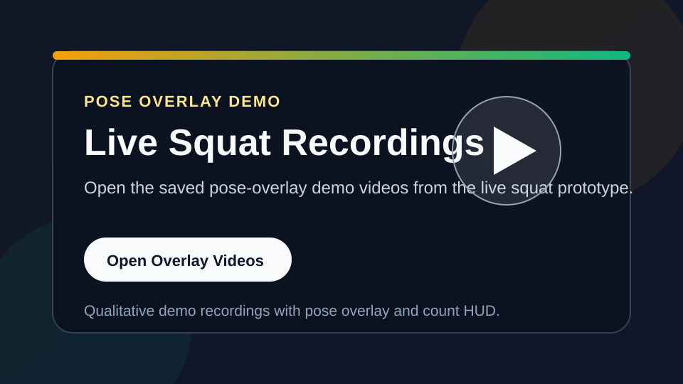

# Exercise Repetition Counting from Video

This repository presents a computer vision project focused on exercise repetition counting from video. The implemented work centers on pose-based and RGB-based experimentation over the LLSP exercise dataset, with particular emphasis on understanding when pose is effective, when RGB is more informative, and how those findings can be converted into a practical counting workflow.

The codebase includes data preparation, pose extraction, feature construction, model training, evaluation, reviewed hard-case analysis, and a scoped squat-only runtime prototype. Countix onboarding utilities are also included, but that branch is intentionally deferred and is not required for the main project conclusions.

In this README, `LLSP` refers to the local exercise-video dataset folder used by the project.

## Executive Summary

This project delivers:

- A complete research pipeline for exercise repetition counting from video
- Comparative evaluation across pose, RGB, multimodal, and routed counting branches
- Documented negative results, not only successful experiments
- A final exercise-dependent conclusion rather than a forced single-model answer
- A squat-only offline runtime and a live squat webcam prototype for practical demonstration

The strongest measured conclusion is that the best representation is exercise-dependent:

- `squat`: pose is the strongest branch
- `push_up`: RGB is the stronger branch
- `pull_up`: mixed and more sensitive to viewpoint, target-selection, and semantic ambiguity

## Project Links

For direct access to the main project surfaces:

- [Project Home](index.html)
- [Architecture Results Dashboard](artifacts/3_Modeling/architecture_results_dashboard.html)
- [EDA Dashboard](artifacts/1_EDA/eda_dashboard.html)
- [Squat Runtime Prototype Page](artifacts/3_Modeling/squat_runtime_dashboard.html)
- [Live Squat Prototype Page](artifacts/3_Modeling/live_squat_runtime_dashboard.html)
- [Live Squat Runtime Script](artifacts/3_Modeling/run_live_squat_counter.py)
- [Hard-Case Review App](artifacts/3_Modeling/hard_case_review_app.html)

## Demo Videos

GitHub README files do not reliably play Google Drive videos inline, so the project uses direct links to the hosted video folders instead.

- [](https://drive.google.com/drive/folders/1ThJeuWPunxmXeUiUak_v11itO7f06UV-?usp=share_link)
- [](https://drive.google.com/file/d/1bfApGNSsjmYzZf8cYgdprZR0rf0TF75r/view?usp=share_link)
- [](https://drive.google.com/drive/folders/1qfd36TFg2N9x2IvZzQyB-5_HhueOjXR6?usp=share_link)
- [LLSP Demo Videos on Google Drive](https://drive.google.com/drive/folders/1ThJeuWPunxmXeUiUak_v11itO7f06UV-?usp=share_link)
- [Main LLSP Dataset Folder on Google Drive](https://drive.google.com/drive/folders/1NUiY4bCTy_zGmJ8AECBcAIpqee5g8F_g?usp=share_link)
- [Live Squat Recordings on Google Drive](https://drive.google.com/drive/folders/1qfd36TFg2N9x2IvZzQyB-5_HhueOjXR6?usp=share_link)
- [Pose Overlay Demo on Google Drive](https://drive.google.com/file/d/1bfApGNSsjmYzZf8cYgdprZR0rf0TF75r/view?usp=share_link)
- [Local Pose Overlay Demo Folder](artifacts/3_Modeling/training_outputs/live_squat_recordings/)
- [Local Pose Overlay Demo 1](artifacts/3_Modeling/training_outputs/live_squat_recordings/live_squat_20260328_170341.mp4)
- [Local Pose Overlay Demo 2](artifacts/3_Modeling/training_outputs/live_squat_recordings/live_squat_20260328_172437.mp4)

These links are intended for video access and qualitative review. Reportable benchmark results remain the metrics and artifacts documented elsewhere in this repository.

## Project Scope

The current repository includes:

- Cleaned LLSP-derived artifacts under `Data/LLSP/annotation_cleaned`
- Countix onboarding scaffolding under `Data/Countix` and `artifacts/2_Data_preparation`
- YOLO-based pose extraction to per-video `.npy` arrays
- Pose indexing and missing-only worklist generation
- Squat video quality auditing utilities
- Notebook-based modeling and evaluation workflows across multiple representation families
- A squat-only runtime counter that runs from video, pose arrays, or squat-feature arrays
- A live squat webcam prototype with overlay, counting display, and optional recording

The repository does not yet include:

- A production-ready webcam application
- A production-ready multi-exercise exercise-recognition and tracking layer
- A finalized multi-exercise packaged inference system

## Squat Runtime Prototype

The smallest practical runtime surface in the repository is the squat-only counter.

Primary files:

- [Runtime Script](artifacts/3_Modeling/run_squat_counter.py)
- [Runtime Page](artifacts/3_Modeling/squat_runtime_dashboard.html)

Supported inputs:

- `--video-path`: Run YOLO pose extraction, build squat features, then count repetitions
- `--pose-path`: Start from an existing `[T, 51]` pose `.npy`
- `--feature-path`: Start from an existing squat-feature `.npy`

Backend configuration:

- Default: Dedicated squat TCN from `artifacts/3_Modeling/training_outputs/squat_tcn_l1_channels96`
- Fallback/reference: Tuned FSM thresholds from the earlier squat tuning stage

Example usage from the repository root:

```bash
source .venv/bin/activate
python3 CV_Image_pose_detection/artifacts/3_Modeling/run_squat_counter.py \
  --video-path CV_Image_pose_detection/Data/LLSP/video/valid/train3946.mp4 \
  --output-json CV_Image_pose_detection/artifacts/3_Modeling/training_outputs/train3946_squat_runtime.json \
  --pretty
```

Force the TCN explicitly:

```bash
python3 CV_Image_pose_detection/artifacts/3_Modeling/run_squat_counter.py \
  --feature-path CV_Image_pose_detection/Data/LLSP/annotation_cleaned/squat_features/train3946_squat_features.npy \
  --counter-backend tcn \
  --pretty
```

Use the FSM reference path explicitly:

```bash
python3 CV_Image_pose_detection/artifacts/3_Modeling/run_squat_counter.py \
  --feature-path CV_Image_pose_detection/Data/LLSP/annotation_cleaned/squat_features/train3946_squat_features.npy \
  --counter-backend fsm \
  --pretty
```

This runtime is intentionally scoped to squat only. It is best described as an offline prototype rather than a production application.

## Live Squat Prototype

The repository also includes a live squat webcam prototype intended for demonstration of the saved squat TCN in an interactive setting.

Primary files:

- [Live Squat Prototype Page](artifacts/3_Modeling/live_squat_runtime_dashboard.html)
- [Live Squat Runtime Script](artifacts/3_Modeling/run_live_squat_counter.py)

Implemented runtime flow:

- Frame-wise YOLO pose extraction
- Tracked target selection derived from the offline pose extractor
- Movement-gated live squat counting from the rolling squat feature stream
- Live TCN support estimate from `artifacts/3_Modeling/training_outputs/squat_tcn_l1_channels96`
- Bounded rolling buffers to avoid unbounded session cost

Example run:

```bash
source .venv/bin/activate
python3 CV_Image_pose_detection/artifacts/3_Modeling/run_live_squat_counter.py \
  --mirror \
  --tcn-device cpu
```

Start recording immediately on launch:

```bash
source .venv/bin/activate
python3 CV_Image_pose_detection/artifacts/3_Modeling/run_live_squat_counter.py \
  --mirror \
  --tcn-device cpu \
  --auto-record
```

Controls:

- `Ctrl+S`: start recording the live overlay window to an `.mp4`
- `e`: stop recording and save the current video
- `r`: reset the current live session buffer and count
- `q`: quit the live window

Recorded videos are written under `artifacts/3_Modeling/training_outputs/live_squat_recordings`.
These files are qualitative demonstration captures of the live overlay and should not be described as benchmark results, reportable evaluation artifacts, or final experimental outputs.

This live path remains a squat-only research prototype. It demonstrates interactive inference, but it should not be presented as a production-ready webcam system.

## Testing

The script-level tests are organized into grouped `unittest` suites under [tests/README.md](/Users/lindaperez/Documents/COMPUTER_VISION/Final_project/personal-git/CV_Image_pose_detection/tests/README.md):

- `data_prep`
- `evaluation`
- `review`
- `runtime`
- `all`

Quick usage from the repo root:

```bash
source .venv/bin/activate
python CV_Image_pose_detection/tests/run_tests.py --list
python CV_Image_pose_detection/tests/run_tests.py runtime
python CV_Image_pose_detection/tests/run_tests.py all
```

The full discovery command still works:

```bash
source .venv/bin/activate
python -m unittest discover -s CV_Image_pose_detection/tests -p 'test_*.py'
```

## Project Status

Current status:

- Implementation: Complete as an offline modular pipeline for data preparation, feature extraction, training, evaluation, and routed counting
- Repository access: Confirmed public by the project owner
- Dataset access: LLSP links are documented below; Countix remains deferred and optional
- Validation: Completed through staged Colab experiments across pose, RGB, multimodal, audit, and routed branches
- Script-level tests: `unittest` coverage exists for key helper modules, review tooling, and runtime paths

Important scope notes:

- This is a research-grade project repository, not a production deployment package
- Colab experiments provide empirical validation, but they do not replace formal unit tests
- The strongest conclusions are exercise-dependent rather than universal across all exercise types

## Distinctive Aspects

Key strengths of the project:

- It extends beyond a single squat-only baseline into a comparative study across `squat`, `pull_up`, and `push_up`
- It records negative and inconclusive findings, not only favorable results
- It shows that representation choice should depend on the exercise rather than assuming pose or RGB will win universally
- It converts those findings into a practical routed counting surface
- It preserves a reproducible artifact structure so experiments remain inspectable and comparable

## Project Team

Project contributors:

- Linda Perez Penaranda: data preparation, modeling experiments, evaluation, documentation, and submission packaging
- Kunyi Shi
- Peihan Wang
- Quanxing Lu

If a more detailed contribution breakdown is needed for submission, this section can be extended with member-specific responsibilities.

## Repository Layout

```text
CV_Image_pose_detection/
├── Data/
│   ├── Countix/
│   │   ├── annotation_cleaned/         # optional Countix benchmark artifacts
│   │   └── video/                      # optional local Countix videos
│   └── LLSP/
│       ├── annotation/                 # original labels
│       ├── annotation_cleaned/         # cleaned labels and generated pose artifacts
│       ├── original_data/              # source references / download links
│       └── video/                      # train, valid, test videos
├── artifacts/
│   ├── 1_EDA/                          # dataset analysis notebooks and plots
│   ├── 2_Data_preparation/             # preparation notebooks
│   └── 3_Modeling/                     # pose extraction, feature extraction, modeling
├── resources/                          # project notes and study materials
└── requirements-pose.txt               # minimal dependencies for pose extraction
```

## Folder Guide

### `artifacts/1_EDA`

This folder contains the exploratory data analysis work used to understand the RepCount / LLSP data before building the pipeline.

Main contents:

- `1_EDA_34.ipynb`: primary EDA notebook
- Class distribution plots such as `class_imbalance_train_valid.png`
- Repetition and duration plots such as `count_distribution.png` and `cycle_duration.png`
- Per-exercise inspection PDFs such as `squat_inspection.pdf`, `push_up_inspection.pdf`, and `pull_up_inspection.pdf`

Purpose:

- Inspect the dataset visually
- Understand class imbalance
- Examine repetition count distributions
- Identify data quality issues before modeling

### `artifacts/2_Data_preparation`

This folder contains the notebook used to clean labels and prepare the dataset contract used by later steps.

Main contents:

- `2_Data_Preparation_01.ipynb`: label cleaning, split checks, and preparation workflow
- `prepare_countix_manifest.py`: normalize external Countix metadata into the repo contract
- `COUNTIX_INTEGRATION.md`: Countix onboarding guide for reusing the pose pipeline

Purpose:

- Clean and standardize the annotations
- Verify train / validation splits
- Keep Countix as a separate benchmark branch rather than silently merging it into LLSP
- Keep Countix deferred unless a later external-validation question requires it
- Produce the cleaned label tables used downstream by the pose and counting stages
- Feed the later generated artifacts under `Data/LLSP/annotation_cleaned`, such as:
  - `pose_feature_index.csv`
  - `pose_sequence_index.csv`
  - `squat_feature_index.csv`

### `artifacts/3_Modeling`

This folder contains the executable modeling pipeline and the Colab notebooks used for squat baselines and the newer all-exercises widening path.

Main contents:

- `build_pose_feature_index.py`: build `pose_feature_index.csv` or `pose_feature_index_squat.csv`
- `build_remaining_pose_worklist.py`: build `pose_feature_index_remaining.csv` for videos that still need pose extraction
- `pose_feature_extraction.py`: run YOLO pose extraction and write raw pose `.npy` arrays
- `analyze_squat_video_quality.py`: audit squat feature outputs and tag likely failure modes
- `apply_validation_review_policy.py`: apply the manual validation-review policy to a TCN `predictions.csv`
- `bootstrap_count_confidence_intervals.py`: estimate bootstrap confidence intervals for `MAE`, `RMSE`, and `Within-1` from a counting `predictions.csv`
- `3_Model_Training_01.ipynb`: baseline temporal training notebook from extracted pose features
- `4_All_Exercises_Pose_Extraction_Colab.ipynb`: Colab stage for widening pose extraction to the remaining exercises
- `5_All_Exercises_Pose_Sequence_Preparation_Colab.ipynb`: Colab stage for generic normalized pose-sequence preparation
- `build_pose_sequence_dataset.py`: build `pose_sequence_index.csv` and `pose_sequence_summary.csv`
- `extract_rgb_frame_features.py`: extract frozen RGB frame-feature sequences from raw videos for a controlled exercise subset
- `train_pose_count_tcn.py`: generic counting-only TCN trainer over normalized pose sequences, with optional exercise-specific keypoint weighting
- `train_pose_count_density_tcn.py`: density-based temporal counting TCN that predicts a non-negative repetition-density curve whose sum gives the final count
- `train_pose_count_transformer.py`: transformer-encoder counting trainer over normalized pose sequences that reuses the Stage 6 augmentation path and artifact contract
- `train_rgb_count_tcn.py`: counting-only TCN trainer over frozen RGB frame-feature sequences
- `train_multimodal_count_tcn.py`: simple late-fusion TCN trainer over paired pose sequences and RGB feature sequences
- `build_routed_count_predictions.py`: assemble an exercise-dependent counting surface from the best current run per exercise
- `audit_counting_hard_cases.py`: audit pose-vs-RGB validation rows with pose quality, video metadata, and issue tags
- `build_hard_case_review_manifest.py`: turn one or more `7D` hard-case audit CSVs into a manual-review manifest with preserved annotations
- `summarize_reviewed_hard_cases.py`: aggregate the reviewed hard-case manifest into confirmed issue counts by exercise and issue type
- `HARD_CASE_REVIEW_GUIDE.md`: review taxonomy and tagging guide for filling `hard_case_review_manifest.csv`
- `hard_case_review_app.html` + `hard_case_review_app.js`: browser-based reviewer for the `7D` hard-case manifest, with video playback and multi-select issue tags
- `hard_case_review_server.py`: tiny local review server with CSV save/load endpoints for the browser review app
- `compare_count_run_to_baseline.py`: compare a finished counting run against a trivial train-split count baseline
- `register_experiment.py`: append or update a row in `experiment_registry.csv`, optionally deriving the result string from `metrics_summary.json`
- `EXPERIMENT_SHOWCASE.md`: compact narrative summary of the main experiments, decisions, and current routed direction
- `experiment_registry.csv`: flat registry table of the main experiments and their decisions
- `ARCHITECTURE_RESULTS_MATRIX.md`: presentation-ready comparison of the architecture families and their measured outcomes
- `architecture_results_long.csv`: long-form architecture-by-exercise result table for sorting or charting
- `6_All_Exercises_Counting_Baseline_Colab.ipynb`: Colab stage for per-exercise counting baselines on generic pose sequences
- `6B_Per_Exercise_SeqLen_Sweep_Colab.ipynb`: Colab stage for exercise-by-exercise sequence-length sweeps starting from the frozen shared baseline
- `6C_Per_Exercise_Keypoint_Weighting_Colab.ipynb`: Colab stage for exercise-specific keypoint weighting after the `6B` temporal sweep
- `6D_Per_Exercise_Density_Counting_Colab.ipynb`: Colab stage for explicit temporal density counting after the scalar TCN, `6B`, and `6C` experiments
- `7_RGB_Counting_Baseline_Colab.ipynb`: Colab stage for the first controlled RGB-vs-pose comparison on `squat`, `pull_up`, and `push_up`
- `7C_Representation_Fit_Analysis_Colab.ipynb`: Colab stage for checking whether RGB wins specifically where pose quality is weaker
- `7B_Stronger_RGB_Backbone_Colab.ipynb`: Colab stage for a stronger RGB backbone comparison after the initial Stage 7 RGB baseline
- `7D_Hard_Case_Data_Audit_Colab.ipynb`: Colab stage for tagging likely visibility, ambiguity, and representation-mismatch failures in the pose-vs-RGB subset
- `7E_Multimodal_Pose_RGB_Fusion_Colab.ipynb`: Colab stage for a simple late-fusion pose+RGB comparison against the best single-modality branches
- `8_Exercise_Dependent_Counting_Colab.ipynb`: Colab stage for building a practical routed counting surface from the best current branch per supported exercise
- `9_Pose_Transformer_Colab.ipynb`: Colab stage for trying a pose-sequence transformer with the same augmentation and comparison contract as the pose TCN runs
- `9B_Pose_Transformer_Augmentation_Ablation_Colab.ipynb`: Colab stage for checking whether the current pose-sequence augmentation settings help or hurt transformer validation results
- `10_PullUp_Dedicated_Pose_Colab.ipynb`: Colab stage for the first dedicated per-exercise pose-tuning follow-up beyond squat, focused on `pull_up`
- `11_Reportable_Confidence_Intervals_Colab.ipynb`: Colab stage for running bootstrap confidence intervals on the final reportable counting runs
- `Data/countix_full_colab.ipynb`: optional Countix subset download notebook, currently deferred from the main experiment flow
- `6_Squat_Rep_Counting_Colab.ipynb`: Colab stage for FSM-based rep counting and evaluation
- `YOLO_PIPELINE.md`, `YOLO_POSE_STAGE.md`, `COLAB_SQUAT_POSE.md`: runbooks and stage documentation
- `COLAB_ALL_EXERCISES_POSE.md`: runbook for widening pose extraction to the remaining exercises
- `COLAB_RGB_COUNTING.md`: runbook for the controlled Stage 7 RGB-vs-pose comparison

Purpose:

- Move from cleaned labels to pose features
- Convert raw pose into either generic normalized pose sequences or squat-specific engineered features
- Run counting baselines and evaluate the squat branch and widened sequence branch
- Support alternative training experiments from extracted features

## Data Snapshot

Dataset access for the LLSP project data:

- Main LLSP dataset folder on Google Drive: https://drive.google.com/drive/folders/1NUiY4bCTy_zGmJ8AECBcAIpqee5g8F_g?usp=share_link
- LLSP video folder on Google Drive: https://drive.google.com/drive/folders/1ThJeuWPunxmXeUiUak_v11itO7f06UV-?usp=share_link
- Live squat recording demos on Google Drive: https://drive.google.com/drive/folders/1qfd36TFg2N9x2IvZzQyB-5_HhueOjXR6?usp=share_link
- Contents: Exercise videos and the related annotation files used by the pipeline
- Expected contents:
  - Raw exercise videos
  - Original annotation CSVs
  - Generated pose and feature artifacts used by the current pipeline
- Notes: Countix is not required for the main project flow and remains deferred as a separate benchmark branch

Original LLSP split annotations checked into this workspace:

- `Data/LLSP/annotation/train.csv`: 758 rows
- `Data/LLSP/annotation/valid.csv`: 131 rows
- `Data/LLSP/annotation/test.csv`: 152 rows

Generated local artifacts under `Data/LLSP/annotation_cleaned` include:

- `pose_feature_index.csv`
- `pose_sequence_index.csv`
- `rgb_feature_index_selected.csv`
- `rgb_feature_index_resnet50_selected.csv`
- `squat_feature_index.csv`
- `squat_feature_summary.csv`
- `squat_rep_count_results.csv`
- `squat_rep_count_results_tuned.csv`

Current synced pose coverage in this workspace:

- Total indexed pose rows: `1041`
- Total local pose feature files: `1003`
- All supported exercise classes except `others` currently have local pose artifacts
- Squat pose features currently exist for `135 / 135` indexed squat videos
- The only indexed rows without local pose files are the `38` `others` rows

## Reproducibility Summary

| Stage | Main entry point | Primary output artifact |
| --- | --- | --- |
| EDA | `artifacts/1_EDA/1_EDA_34.ipynb` | dataset plots and inspection PDFs |
| Data preparation | `artifacts/2_Data_preparation/2_Data_Preparation_01.ipynb` | cleaned label tables used to derive downstream `annotation_cleaned` artifacts |
| Pose indexing | `artifacts/3_Modeling/build_pose_feature_index.py` | `pose_feature_index.csv` |
| Pose extraction | `artifacts/3_Modeling/pose_feature_extraction.py` | raw pose `.npy` files, `pose_extraction_report.csv`, `pose_extraction_summary.json` |
| Pose sequences | `artifacts/3_Modeling/build_pose_sequence_dataset.py` | `pose_sequence_index.csv`, `pose_sequence_summary.csv` |
| Shared pose baselines | `artifacts/3_Modeling/6_All_Exercises_Counting_Baseline_Colab.ipynb` | per-run `training_outputs/<run_name>/metrics_summary.json` and `predictions.csv` |
| RGB branch | `artifacts/3_Modeling/7_RGB_Counting_Baseline_Colab.ipynb` and `7B_Stronger_RGB_Backbone_Colab.ipynb` | RGB feature directories and RGB `training_outputs` artifacts |
| Audits | `artifacts/3_Modeling/7C_Representation_Fit_Analysis_Colab.ipynb` and `7D_Hard_Case_Data_Audit_Colab.ipynb` | representation-fit summaries and hard-case audit CSV/JSON artifacts |
| Routed counting | `artifacts/3_Modeling/8_Exercise_Dependent_Counting_Colab.ipynb` | `routed_predictions.csv`, `routed_metrics_summary.json`, `routing_summary.csv` |
| Experiment registry | `artifacts/3_Modeling/register_experiment.py` | `experiment_registry.csv` |

## Environment Setup

Create and activate a virtual environment, then install the pose dependencies:

```bash
python3 -m venv .venv
source .venv/bin/activate
python3 -m pip install --upgrade pip
python3 -m pip install -r CV_Image_pose_detection/requirements-pose.txt
```

Current pose extraction dependencies:

- `numpy`
- `opencv-python`
- `ultralytics`

Optional tools used by the audit workflow:

- `ffmpeg`
- `ffprobe`

To run the lightweight script-level tests:

```bash
python3 -m unittest discover -s CV_Image_pose_detection/tests -p 'test_*.py'
```

These tests complement, but do not replace, the staged Colab experiment validation used throughout the project.

## Testing and Validation

Validation currently happens at two levels:

- Experiment-level validation through the staged Colab runs across pose, RGB, multimodal, audit, and routed branches
- Lightweight script-level testing through `unittest` suites for data preparation helpers, manifest normalization, experiment-registry and routing utilities, hard-case review tooling, and squat runtime/live-counter paths

This gives the project:

- Empirical validation on real dataset subsets
- Basic regression protection for core utility and artifact-building code paths

## Model Checkpoint

The pose extraction scripts use the YOLO pose checkpoint currently stored at:

```text
CV_Image_pose_detection/artifacts/3_Modeling/yolo11n-pose.pt
```

This file is already present in the workspace.

## Main Pipeline and Run Order

The project has one main squat-focused path and one optional experimental branch.

### Main Squat Pipeline

Run these in order:

1. `artifacts/1_EDA/1_EDA_34.ipynb`
   Use this first if you want to understand the dataset and class distributions before building features.

2. `artifacts/2_Data_preparation/2_Data_Preparation_01.ipynb`
   Produces the cleaned annotations used by the later stages.

3. `artifacts/3_Modeling/build_pose_feature_index.py`
   Build the squat-only index from the cleaned annotations.

4. `artifacts/3_Modeling/4_All_Exercises_Pose_Extraction_Colab.ipynb`
   Reads videos and writes raw pose arrays in `pose_features/` for the remaining exercises.

5. `artifacts/3_Modeling/5_All_Exercises_Pose_Sequence_Preparation_Colab.ipynb`
   Reads `pose_features/` and writes generic normalized pose sequences in `pose_sequences/`, plus:
   - `pose_sequence_index.csv`
   - `pose_sequence_summary.csv`

6. `artifacts/3_Modeling/6_All_Exercises_Counting_Baseline_Colab.ipynb`
   Reads `pose_sequence_index.csv` and trains counting-only TCN baselines on normalized pose sequences, reporting per-exercise `MAE`, `RMSE`, and `Within-1`.

7. `artifacts/3_Modeling/6_Squat_Rep_Counting_Colab.ipynb`
   Historical squat-specific FSM notebook retained for the original single-exercise branch.

8. `artifacts/3_Modeling/analyze_squat_video_quality.py`
   Optional audit step after feature extraction when you want to inspect difficult squat videos or diagnose pose/feature quality issues.

9. `artifacts/3_Modeling/apply_validation_review_policy.py`
   Optional post-evaluation step after TCN training when you want to apply the reviewed keep/flag/exclude policy to the latest `predictions.csv` artifact and export filtered validation metrics.

### Widening Pose Extraction Path

When you are ready to move beyond the frozen squat-only branch:

1. `artifacts/3_Modeling/build_pose_feature_index.py`
   Build the full multi-exercise pose index.

2. `artifacts/3_Modeling/build_remaining_pose_worklist.py`
   Compare the full index against existing `.npy` artifacts and write the missing-only worklist.

3. `artifacts/3_Modeling/pose_feature_extraction.py`
   Run YOLO pose extraction on `pose_feature_index_remaining.csv` to cover the remaining exercises.

4. `artifacts/3_Modeling/5_All_Exercises_Pose_Sequence_Preparation_Colab.ipynb`
   Convert the raw YOLO pose arrays into normalized generic sequences and write `pose_sequence_index.csv`.

5. `artifacts/3_Modeling/6_All_Exercises_Counting_Baseline_Colab.ipynb`
   Train counting-only per-exercise TCN baselines on the normalized pose sequences.

6. `artifacts/3_Modeling/6B_Per_Exercise_SeqLen_Sweep_Colab.ipynb`
   Sweep `seq_len` values for the most promising exercises before changing representations or adding exercise-specific weighting.

7. `artifacts/3_Modeling/6C_Per_Exercise_Keypoint_Weighting_Colab.ipynb`
   Reuse the best `seq_len` per exercise from `6B` and test exercise-specific keypoint emphasis without rebuilding Stage 5.

8. `artifacts/3_Modeling/6D_Per_Exercise_Density_Counting_Colab.ipynb`
   Reuse the best `seq_len` per exercise from `6B`, but switch the counting formulation from direct scalar regression to temporal density prediction.

9. `artifacts/3_Modeling/7_RGB_Counting_Baseline_Colab.ipynb`
   Extract frozen RGB features for `squat`, `pull_up`, and `push_up`, then train RGB TCN baselines and compare them directly against the best pose `6B` runs.

10. `artifacts/3_Modeling/COLAB_ALL_EXERCISES_POSE.md`
   Use this runbook when executing the widening step in Colab.

### Optional Local Script Path

If you do not want to use Colab for pose extraction, the local script path is:

1. `build_pose_feature_index.py`
2. `pose_feature_extraction.py`
3. downstream Colab or notebook stages for squat features and rep counting

### Optional Experimental Branch

`artifacts/3_Modeling/3_Model_Training_01.ipynb` is a separate experimental branch for training a temporal regressor from extracted pose features. It is not the main squat FSM pipeline and should be treated as an alternative modeling path.

### Post-TCN Validation Review

After producing a new `predictions.csv` from the TCN training stage, apply the reviewed validation policy:

```bash
python3 CV_Image_pose_detection/artifacts/3_Modeling/apply_validation_review_policy.py \
  --predictions-csv CV_Image_pose_detection/artifacts/3_Modeling/training_outputs/<run_name>/predictions.csv \
  --review-csv CV_Image_pose_detection/artifacts/3_Modeling/validation_failure_review.csv
```

This writes:

- `policy_filtered_metrics_summary.json`
- `policy_filtered_valid_predictions.csv`

next to the supplied `predictions.csv`, so the project keeps both:

- The raw validation metrics
- The filtered view that excludes confirmed upstream failures and tags reviewed hard cases

### Bootstrap Confidence Intervals

After producing a final `predictions.csv`, estimate uncertainty on the reported metrics:

```bash
python3 CV_Image_pose_detection/artifacts/3_Modeling/bootstrap_count_confidence_intervals.py \
  --predictions-csv CV_Image_pose_detection/artifacts/3_Modeling/training_outputs/<run_name>/predictions.csv \
  --exercise squat \
  --split valid \
  --bootstrap-samples 5000 \
  --seed 7
```

This writes `bootstrap_confidence_intervals.json` beside the selected `predictions.csv`, including:

- Point estimates for `MAE`, `RMSE`, and `Within-1`
- Percentile bootstrap confidence intervals for the same metrics
- The row count and bootstrap configuration used

### Reviewed Hard-Case Layer

To turn the heuristic `7D` audit into a confirmed review layer, first build a manual-review manifest:

```bash
python3 CV_Image_pose_detection/artifacts/3_Modeling/build_hard_case_review_manifest.py \
  --audit-csv CV_Image_pose_detection/artifacts/3_Modeling/training_outputs/rgb_count_tcn_squat_seq256/hard_case_audit.csv \
  --audit-csv CV_Image_pose_detection/artifacts/3_Modeling/training_outputs/rgb_count_tcn_pull_up_seq192/hard_case_audit.csv \
  --audit-csv CV_Image_pose_detection/artifacts/3_Modeling/training_outputs/rgb_count_tcn_push_up_seq128/hard_case_audit.csv \
  --output-csv CV_Image_pose_detection/artifacts/3_Modeling/training_outputs/hard_case_review_manifest.csv
```

Then fill the manual columns in `hard_case_review_manifest.csv`, especially:

- `manual_review_status`
- `manual_primary_issue`
- `manual_issue_tags`
- `manual_target_person_ok`
- `manual_count_label_ok`
- `manual_rep_definition_ambiguous`
- `manual_visibility_issue_confirmed`
- `manual_pose_failure_confirmed`
- `manual_rgb_context_advantage_confirmed`
- `manual_keep_for_report`
- `manual_notes`

For a consistent issue taxonomy, use:

- [`HARD_CASE_REVIEW_GUIDE.md`](artifacts/3_Modeling/HARD_CASE_REVIEW_GUIDE.md)

If you want a browser UI for the selected hard cases instead of editing the CSV directly:

1. Start the review server from the repo root:

```bash
cd CV_Image_pose_detection
python3 artifacts/3_Modeling/hard_case_review_server.py --port 8000
```

2. Open:

```text
http://localhost:8000/artifacts/3_Modeling/hard_case_review_app.html
```

3. Load the manifest from:

```text
artifacts/3_Modeling/training_outputs/hard_case_review_manifest.csv
```

If you prefer a static read-only setup, `python3 -m http.server 8000` still works,
but backend save/load requires `hard_case_review_server.py`.

The app lets you:

- Click through the selected hard-case rows
- Watch the corresponding video
- Overlay the saved pose keypoints and skeleton lines on top of the video
- Show a playback HUD with the clip-level annotations and audit fields
- Inspect the original `L*` repetition intervals from `Data/LLSP/annotation/{train,valid,test}.csv`
- Choose one `manual_primary_issue`
- Assign multiple secondary `manual_issue_tags`
- Edit the remaining `manual_*` review fields
- Save the current review through the local review server
- Export an updated CSV for `summarize_reviewed_hard_cases.py`

The pose overlay uses the raw `pose_features/*.npy` files from Stage 4. Because
those arrays contain only frames with successful pose extraction, the overlay is
time-aligned approximately by playback progress rather than exact frame index.

The annotation HUD is clip-level, not frame-level. It shows fields such as:

- Exercise label
- Split
- True count
- Pose prediction
- RGB prediction
- Model outcome
- Current playback time

The original LLSP annotation intervals are loaded from the raw split CSVs and
shown as frame ranges plus approximate seconds using the audited FPS value. The
currently active interval is highlighted while the video plays.

When served from the repo root, the default video base path in the app is:

```text
/Data/LLSP/video/
```

That maps to the local folder:

```text
/Users/lindaperez/Documents/COMPUTER_VISION/Final_project/personal-git/CV_Image_pose_detection/Data/LLSP/video
```

After review, summarize the confirmed issues:

```bash
python3 CV_Image_pose_detection/artifacts/3_Modeling/summarize_reviewed_hard_cases.py \
  --review-csv CV_Image_pose_detection/artifacts/3_Modeling/training_outputs/hard_case_review_manifest.csv
```

This writes:

- `reviewed_hard_case_summary.json`
- `reviewed_hard_case_primary_issues.csv`

The goal is to distinguish confirmed data-side problems, label ambiguity, and true model failures rather than relying only on heuristic `7D` buckets.

### 1. Build a Pose Feature Index

Generate an index for every cleaned sample:

```bash
python3 CV_Image_pose_detection/artifacts/3_Modeling/build_pose_feature_index.py
```

Generate a squat-only index:

```bash
python3 CV_Image_pose_detection/artifacts/3_Modeling/build_pose_feature_index.py \
  --exercise squat \
  --output-csv CV_Image_pose_detection/Data/LLSP/annotation_cleaned/pose_feature_index_squat.csv
```

The generated CSV maps each video name to a target `.npy` output path and preserves the exercise label, split, and rep count.

Generate the full multi-exercise index:

```bash
python3 CV_Image_pose_detection/artifacts/3_Modeling/build_pose_feature_index.py \
  --output-csv CV_Image_pose_detection/Data/LLSP/annotation_cleaned/pose_feature_index.csv
```

Build the missing-only worklist for the remaining exercises:

```bash
python3 CV_Image_pose_detection/artifacts/3_Modeling/build_remaining_pose_worklist.py \
  --exclude-exercise others
```

### 2. Extract Pose Features with YOLO

Run extraction from an existing index:

```bash
python3 CV_Image_pose_detection/artifacts/3_Modeling/pose_feature_extraction.py \
  --index-csv CV_Image_pose_detection/Data/LLSP/annotation_cleaned/pose_feature_index.csv \
  --video-dir CV_Image_pose_detection/Data/LLSP/video \
  --model CV_Image_pose_detection/artifacts/3_Modeling/yolo11n-pose.pt
```

Useful debugging example:

```bash
python3 CV_Image_pose_detection/artifacts/3_Modeling/pose_feature_extraction.py \
  --index-csv CV_Image_pose_detection/Data/LLSP/annotation_cleaned/pose_feature_index_squat.csv \
  --video-dir CV_Image_pose_detection/Data/LLSP/video \
  --model CV_Image_pose_detection/artifacts/3_Modeling/yolo11n-pose.pt \
  --max-videos 5 \
  --overwrite
```

What the extractor does for each frame:

1. opens the video with OpenCV
2. runs YOLO pose inference
3. selects the primary person
4. stores 17 keypoints with `x`, `y`, and confidence
5. flattens each frame into a 51-value feature vector

Output format:

- One `.npy` file per video
- Array shape: `[T, 51]`
- Fallback shape when no pose is found: `[1, 51]` filled with zeros

Generated outputs are written under `Data/LLSP/annotation_cleaned/pose_features` together with:

- `pose_extraction_report.csv`
- `pose_extraction_summary.json`

### 3. Audit Squat Video Quality

The audit script joins summary statistics with local videos and tags common failure modes such as low confidence, poor lower-body visibility, or portrait framing.

It expects the squat feature summary generated in the squat feature extraction workflow, typically:

```text
CV_Image_pose_detection/Data/LLSP/annotation_cleaned/squat_feature_summary.csv
```

Example:

```bash
python3 CV_Image_pose_detection/artifacts/3_Modeling/analyze_squat_video_quality.py \
  --summary-csv CV_Image_pose_detection/Data/LLSP/annotation_cleaned/squat_feature_summary.csv
```

Audit outputs are written to `artifacts/3_Modeling/squat_video_audit/`.

### 4. Continue in Notebooks

Most downstream experimentation currently lives in notebooks:

- `artifacts/1_EDA/1_EDA_34.ipynb`
- `artifacts/2_Data_preparation/2_Data_Preparation_01.ipynb`
- `artifacts/2_Data_preparation/COUNTIX_INTEGRATION.md`
- `artifacts/3_Modeling/3_Model_Training_01.ipynb`
- `artifacts/3_Modeling/4_All_Exercises_Pose_Extraction_Colab.ipynb`
- `artifacts/3_Modeling/5_All_Exercises_Pose_Sequence_Preparation_Colab.ipynb`
- `artifacts/3_Modeling/6_All_Exercises_Counting_Baseline_Colab.ipynb`
- `artifacts/3_Modeling/6_Squat_Rep_Counting_Colab.ipynb`

## Current Metrics

The project does not yet have a checked-in final rep-count evaluation report, but these metrics are currently available in the workspace.
Saved live runtime JSON files and `live_squat_recordings` videos are not part of the reportable benchmark
results below; they are prototype demo artifacts for qualitative inspection only.

### Pose Extraction Status

From `Data/LLSP/annotation_cleaned/pose_extraction_summary.json`:

- Processed rows: `118`
- Successful extractions: `118`
- Failed extractions: `0`
- Zero-pose outputs: `0`
- Run cap used for that check: none (`max_videos = 0`)

### Squat Video Quality Audit

From `artifacts/3_Modeling/squat_video_audit/squat_video_audit_summary.json`:

- Audited squat videos: `118`
- Severity breakdown:
  - `ok`: `90`
  - `review`: `15`
  - `medium`: `11`
  - `high`: `1`
  - `critical`: `1`
- Low-confidence counts:
  - mean confidence `< 0.25`: `1`
  - mean confidence `< 0.40`: `2`
  - mean confidence `< 0.50`: `4`
  - mean confidence `< 0.70`: `21`
- Lower-body validity counts:
  - valid ratio `< 0.25`: `2`
  - valid ratio `< 0.50`: `2`
  - valid ratio `< 0.75`: `5`
  - valid ratio `< 0.90`: `12`

### Training Alignment Readiness

From `artifacts/3_Modeling/training_outputs/baseline_v2_rebuilt/feature_alignment_report.json`:

- Train rows in cleaned labels: `732`
- Valid rows in cleaned labels: `131`
- Train rows aligned to current feature files: `20`
- Valid rows aligned to current feature files: `0`

### Rep Counting Evaluation

The project now has reportable rep-count point estimates plus Stage `11` bootstrap confidence intervals for the dedicated `squat` control and the routed `pull_up` / `push_up` branches.

Reported metrics:

- `MAE`
- `RMSE`
- `Within-1 accuracy`

Current reportable metrics with `95%` bootstrap confidence intervals:

- `squat` dedicated pose control (`squat_tcn_l1_channels96`, `n=16`)
  - `MAE = 2.1405`, `95% CI [1.1266, 3.3313]`
  - `RMSE = 3.1016`, `95% CI [1.6982, 4.2837]`
  - `Within-1 = 0.5625`, `95% CI [0.3125, 0.8125]`

- `pull_up` routed pose branch (`pose_count_tcn_pull_up_seq192`, `n=14`)
  - `MAE = 4.6088`, `95% CI [2.0863, 7.5386]`
  - `RMSE = 7.0169`, `95% CI [3.5909, 9.7687]`
  - `Within-1 = 0.4286`, `95% CI [0.2143, 0.7143]`
- `push_up` routed RGB branch (`rgb_count_tcn_push_up_seq128`, `n=18`)
  - `MAE = 6.6018`, `95% CI [3.3063, 10.4238]`
  - `RMSE = 10.2865`, `95% CI [5.1748, 14.8974]`
  - `Within-1 = 0.2778`, `95% CI [0.0556, 0.5000]`

## Notes and Caveats

- The repository contains large local assets including videos, a YOLO checkpoint, and intermediate artifacts.
- The workflow is currently notebook-first for modeling and analysis.
- The project documentation in `artifacts/specification.md` describes a broader future direction called `RepCoach`, but the implemented code in this repo is narrower and focused on offline experimentation.
- The strongest current result is an exercise-dependent routed system, not one universal counter.
- Countix is scaffolded but deferred; it is not part of the active LLSP conclusion surface.
- Validation slices for some exercises remain small, so some results should be interpreted as scoped research evidence rather than final deployment claims.

## Useful Files

- `artifacts/specification.md`: target product and system design
- `artifacts/repcount_analysis.md`: dataset notes
- `artifacts/3_Modeling/YOLO_PIPELINE.md`: pose extraction runbook
- `artifacts/3_Modeling/COLAB_SQUAT_POSE.md`: Colab workflow for squat extraction

## Next Steps

Reasonable next improvements for this project are:

- Move notebook logic into reusable Python modules
- Add a documented training and evaluation script for rep counting
- Formalize metrics for per-exercise mean absolute error
- Stabilize the live squat prototype further across camera setups and movement speeds
- Extend the live path beyond squat only if a later project phase requires full recognition and tracking
